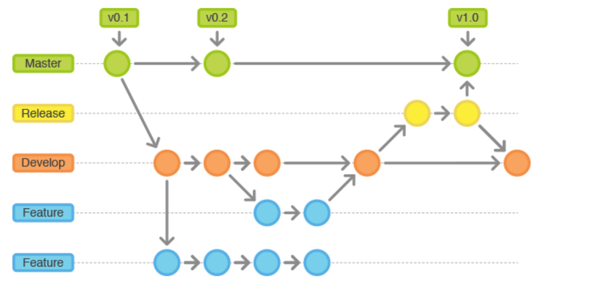

## Finance Data Analyst

We are going to work with:

- [x] Python
- [x] SQL
- [x] Git
- [x] Visual Studio Code
- [x] Jupyter Notebook
- [x] Data Science
- [x] Machine Learning


### Python Automation

**To do List: Project**

Description: 

(WIP = Work in Progress)
- **Collect data (Web Scrape)**
  - [x] WIP 
  - [ ] DONE
- **Storage data in csv or sql**
  - [x] WIP 
  - [ ] DONE
- **Workaround with the data - output: Results**
  - [x] WIP 
  - [ ] DONE
- **Generate a PDF report and send by e-mail**
  - [x] WIP 
  - [ ] DONE

#### Kaggle

```
python -m pip install kaggle

kaggle datasets list -s 'finance'

kaggle datasets download -d noriuk/us-educational-finances
```


source dataset: [](https://www.kaggle.com/datasets/paultimothymooney/stock-market-data) **Large dataset**

Just do the download of the file - **AAPL.csv**:


### Install Packages:

```pip install -r requirements.txt

#### Dataset

```
kaggle datasets download -d noriuk/us-educational-finances
```

#### Install Requirements

```
python -m pip install -r requirements.txt
```

### Generate Fake dataset

``` # generate dataset
# folder : python

python gendata.py 100
```


### What is Git ?

Git is a free and open source distributed version control system. Git’s purpose is to keep track of projects and files as they change over time with manipulations happening from different users. Git stores information about the project’s progress on a repository.


### Let's Start

#### Basic commands

Terminal:
```Bash
### Basic commands to start to work with git version control:

# clone the repository in own local machine
$ git clone https://github.com/andvsilva/finance-data-analyst.git

cd finance-data-analyst

# shows the modifications of the files and folder
$ git status

# add a new file.
$ git add new_file

# add ALL to change to repository
# just do
$ git add "new_file"  # to all the files you can use "."

# commit the changes to the repository
# flag '-m' is for message, talk about the change you make
$ git commit -m "Add a new file"

# get the currenty version of the project from the repository
$ git pull origin master

# send the change to repository
$ git push origin master

# SSH Keys
SSH keys allow you to establish a secure connection between your computer and github.
To use Private/Public key

# First of all, you need to generate the private and
# public key, using the command below:
# email associated to github

$ ssh-keygen -t rsa -b 4096 -C "email@...com" 

# press enter some times
$ cat ~/.ssh/id_rsa.pub # print the public key

# copy and Paste your public 'SSH key' to github:
# This will allow you pull/push without use a password.

# In the Folder repository local machine, you need use the 
# command below to set url to remote repository.

$ git remote set-url origin git@github.com:andvsilva/finance-data-analyst.git
# command to save the local change in your machine
# you can use the command:
# If you did some change and not yet ready
# to commit to remote repository.
$ git stash
```

### History of the project in time



This is the basics commands to start to work with Git. For more information, please see the useful references in the final of this document.


## Useful References:

### To understanding Git:
- [Understanding Git Version Control](https://medium.com/@friesamuel/understanding-git-version-control-f23a439554fe)

- [Understanding Git: basics, commands, tips & tricks](https://medium.com/faun/understanding-git-basics-commands-tips-tricks-da0c05db411f)

- [18 Git Commands I Learned During My First Year as a Software Developer](https://towardsdatascience.com/git-commands-cheat-sheet-software-developer-54f6aedc1c46)

- [Git Commands to Live By](https://medium.com/better-programming/git-commands-to-live-by-349ab1fe3139)

### Data Version Control (DVC)
- [Open-source Version Control System for Machine Learning Projects](https://dvc.org/)
- [A Brief Introduction to Data Version Control (DVC)](https://connate.medium.com/a-brief-introduction-to-data-version-control-dvc-82ec5ee76c2b)

### SSH keys

- [Generating a new SSH key and adding it to the ssh-agent](https://docs.github.com/en/github/authenticating-to-github/generating-a-new-ssh-key-and-adding-it-to-the-ssh-agent)

- [Adding a new SSH key to your GitHub account](https://docs.github.com/en/github/authenticating-to-github/adding-a-new-ssh-key-to-your-github-account)

### YouTube:
- [Git Tutorial for Beginners: Command-Line Fundamentals](https://www.youtube.com/watch?v=HVsySz-h9r4&list=PL-osiE80TeTuRUfjRe54Eea17-YfnOOAx&ab_channel=CoreySchafer) (This is a good playlist to start to learn the basics fundamentals - Git and also programming in general. Have fun :))
